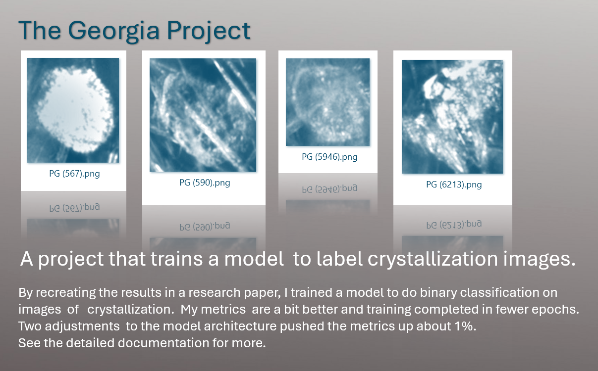

  

## Content. 
[Quick start.](#quick-start) • 
[Slow start.](#slow-start) • 
[Model comparison](#model-comparison) • 
[Contributions](#contributions) • 
[Known issues](#known-issues) • 
[Contact info](#contact-info)

## Quick start. 
1. Set up the code for this project.  
   - Download the [source code ZIP file.](https://github.com/KatherineMossDeveloper/The-Georgia-Project/archive/refs/tags/v1.0.zip) or the [source code TAR file.](https://github.com/KatherineMossDeveloper/The-Georgia-Project/archive/refs/tags/v1.0.tar.gz) and extract it.  
   - Set up a Python environment, if you don't already have one.  I used PyCharm, ver. 2023.2.4, Community Edition.  
   - Install dependencies as needed.  I used Python 3.8, TensorFlow 2.10.1, and Keras 2.10.0.  

2. Get the data from Kaggle.  
   - Download [OpenCrystalData Crystal Impurity Detection](https://www.kaggle.com/datasets/opencrystaldata/cephalexin-reactive-crystallization?resource=download) and extract it.  
   - Edit `GAsplitDataIntoTrainValidandTest.py` so that the folder_prefix variable points to the OpenCrystalData on your pc. 
   - Run GAsplitDataIntoTrainValidandTest.py to split the data up into training, validation, and testing. 

3. Run the training.  
   - Edit GAmain.py so that the folder_prefix variable points to the OpenCrystalData on your pc. 
   - Run GAmain.py to train the model.
   - Check the results in the \GAdeliverables folder (where you extracted the data).  
   
4. Play time.
   - Download the [weights file here](https://github.com/KatherineMossDeveloper/The-Georgia-Project/releases/download/v1.0/GAweights.h5) to the \inference folder.
   - Edit GAinference.py so that the folder_prefix variable points to the Georgia Project code. 
   - Run GAinference.py to label images in the \inference folder.  

## Slow start.  
The scientists who wrote the paper trained ResNet models with ImageNet weights on the OpenCrystalData dataset. The models were trained to do binary classification of images of crystals, designating them as either CEX (a.k.a., “cephalexin antibiotic,” a good thing) or PG (a.k.a. “phenylglycine,” a bad thing).  This project recreates their work.  

Here is the research paper. 
Salami, H., McDonald, M. A., Bommarius, A. S., Rousseau, R. W., & Grover, M. A. (2021). [In Situ Imaging Combined with Deep Learning for Crystallization Process Monitoring: Application to Cephalexin Production](https://doi.org/10.1021/acs.oprd.1c00136). *Organic Process Research & Development, 25*(7), 1670–1679. 

Here is the Georgia Project's documentation.  
[Go to the main doc file](docs/maindoc.md)    

## Model comparison.  
In the table below are the details offered by the published paper, then on the right are the choices that I elected to work with.   
|                         |Salami et al. paper     |my work                |
|-------------------------|------------------------|-----------------------|
|model type               |ResNet-18, ResNet-50    |ResNet-101             |
|optimization method      |SGDM	                  |Keras SGD (momentum .9)|
|learning rate	      	  |1 × 10−4                |1 × 10−1	            |
|training data            |3200−3600 in each class |(same)                 |
|train/val./test %        |70/25/5%                |(same)                 |
|minibatch size           |32−64                   |64                     |
|validation frequency     |10−50                   |1                      |
|added dropout layers     |(did not comment)       |2                      |
|trainable ImageNet layers|(did not comment)       |made last 10% trainable|

## Contributions.  
If you found an issue or would like to make a suggestion for an improvement to the code or documentation, please click on the issue tab on the project page and leave me a note.  If you like this project, leave a star.  

## Known issues.  
None.  

## Contact info.                                                                     
For more details about this project, feel free to reach out to me at katherinemossdeveloper@gmail.com or [LinkedIn](https://www.linkedin.com/pub/katherine-moss/3/b49/228) .  
My time zone is EST in the U.S.

[back to top](#content) 

