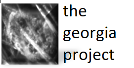
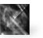
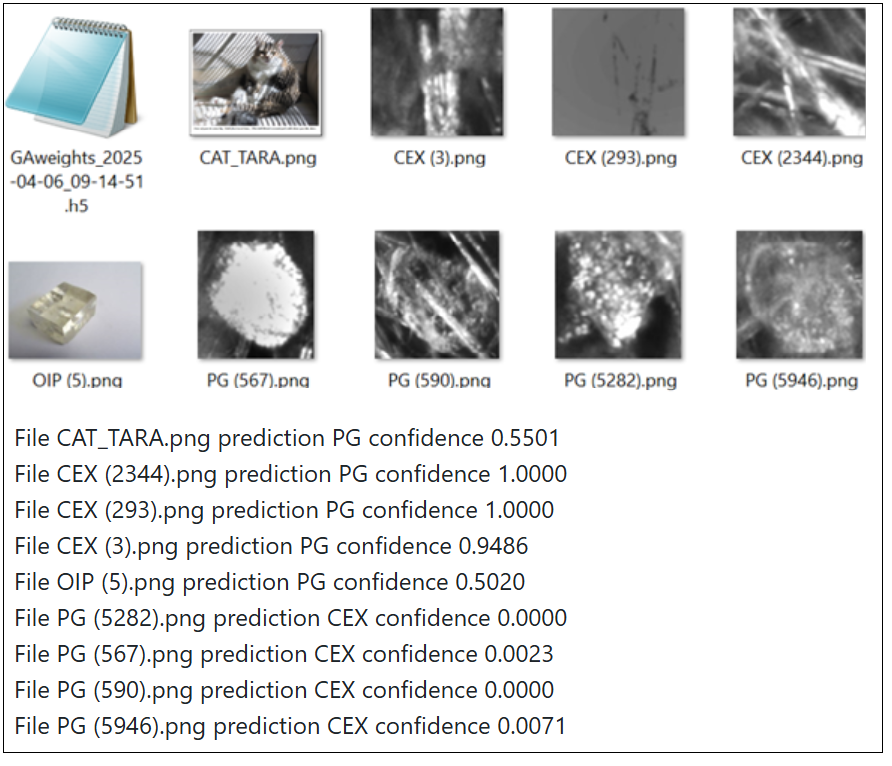
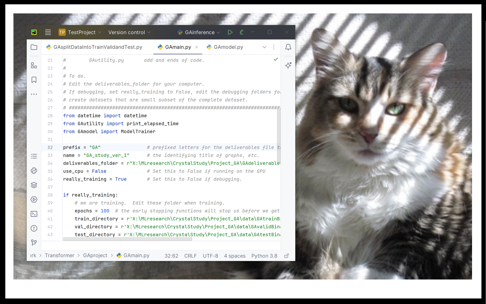

### Contents:
- [The overview.](#the-overview).
- [The paper.](#the-paper).
- [The goals.](#the-goals).
- [The development environment.](#the-development-environment).
- [The model architecture.](#the-model-architecture).
- [The data.](#the-data).
- [The results.](#the-results).
- [The georgia code and deliverables.](#the-georgia-code-and-deliverables).
- [ How to recreate the results.](#how-to-recreate-the-results).
- [The license.](#the-license).
- [How to contact me](#how-to-contact-me).
- [The footnotes.](#the-footnotes).

## The overview
 The overview.  
## The paper
 The paper.  
## The goals
 The goals.  
 The development environment.  
 The model architecture.  
 The data.  
 The results.  

This project trains an A.I. model to label images in a crystallization dataset.  You can train the model, or use the weights file included, to label images of your own.  


 The georgia code and deliverables.  
 How to recreate the results.  
 The license.  
 How to contact me.  
 The footnotes.  




Go to another md file...
[Go to the ReadmeAux file](docs/ReadmeAux.md)

Go to another section in this md file...
[Go to Section 5](docs/ReadmeAux.md#section-5-methodology)

Example hyperlink 
- [OpenCrystalData](https://www.kaggle.com/datasets/opencrystaldata/cephalexin-reactive-crystallization?resource=download) - HTML

### Bulleted List:
- Item 1
- Item 2
- Item 3

This is some more text with a footnote[^1].

[^1]: This is the footnote content, which can provide more information or a citation.

## Minor Heading
> The overriding design goal for Markdown's
> formatting syntax is to make it as readable

This text you see here is *actually- written in Markdown! To get a feel
for Markdown's syntax, type some text into the left window and
watch the results in the right.

| Plugin | README |
| ------ | ------ |
| Dropbox | [plugins/dropbox/README.md][PlDb] |
| GitHub | [plugins/github/README.md][PlGh] |
| Google Drive | [plugins/googledrive/README.md][PlGd] |
| OneDrive | [plugins/onedrive/README.md][PlOd] |

### Python Code Example
```python
def hello_world():
    print("Hello, World!")
```markdown
