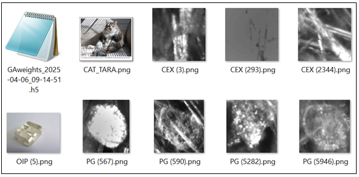

This project trains an A.I. model to label images in a crystallization dataset.  You can train the model, or use the weights file included, to label images of your own.  


File CAT_TARA.png	 prediction PG confidence 0.5501  
File CEX (2344).png	 prediction PG confidence 1.0000  
File CEX (293).png	 prediction PG confidence 1.0000  
File CEX (3).png	 prediction PG confidence 0.9486  
File OIP (5).png	 prediction PG confidence 0.5020  
File PG (5282).png	 prediction CEX confidence 0.0000  
File PG (567).png	 prediction CEX confidence 0.0023  
File PG (590).png	 prediction CEX confidence 0.0000  
File PG (5946).png	 prediction CEX confidence 0.0071  


### Contents:
- [The overview.](#the-overview).
- [The paper.](#the-paper).
- [The goals.](#the-goals).
- [The development environment.](#the-development-environment).
- [The model architecture.](#the-model-architecture).
- [The data.](#the-data).
- [The results.](#the-results).
- [The georgia code and deliverables.](#the-georgia-code-and-deliverables).
- [ How to recreate the results.](#how-to-recreate-the-results).
- [The license.](#the-license).
- [How to contact me](#how-to-contact-me).
- [The footnotes.](#the-footnotes).

## The overview
 The overview.  
I am pleased to say that I have successfully trained an A.I. model to distinguish between two crystal types in images.  The trained model had all F1 scores above 99.7% in 5 epochs or less. 

I am a software developer doing an independent study into using machine learning to identify crystallization in images.  I found an interesting dataset and a really good research paper on the topic, so I wrote code to train on the data, using the paper for guidance.  I am posting the code and results here in the hope that others will also find it interesting.  

I found the crystal image dataset on Kaggle.  I decided to work with it because there were enough images to train with, and the images are all high quality.  Here is the hyperlink to the dataset.  

https://www.kaggle.com/datasets/opencrystaldata/cephalexin-reactive-crystallization?resource=download
The dataset I found was collected using Mettler-Toledo, LLC, (MT) instrumentation.  While this is not a research paper, where one would typically make an affiliation statement, I should mention that I worked at MT on their vision products for years.  However, I am no longer affiliated with the Company and am not necessarily endorsing their products here, nor have I used any intellectual property owned by MT.  

I chose crystallization in images because I think it is an important area of A.I.  Other corners of the A.I. world, like LLM’s, video creation, and robotics, are in the news more these days, but the detection and categorization of crystallization in images is important because it is used in the food processing, drug discovery, quality control in manufacturing, etc.  It would be good to have more developers and data scientists interested in this part of A.I.  

This study is about the crystallization dataset on Kaggle.  However, in this documentation, to make things easer, I will refer to the dataset as the “GA data,” and this project as the “Georgia Project,” since all of the authors were at the School of Chemical & Biomolecular Engineering, Georgia Institute of Technology in Atlanta, GA, which happens to be my husband’s alma mater.  

## The paper
 The paper.  
The dataset references a paper, 
In Situ Imaging Combined with Deep Learning for Crystallization Process Monitoring: Application to Cephalexin Production.  
Hossein Salami, Matthew A. McDonald, Andreas S. Bommarius, Ronald W. Rousseau, and Martha A. Grover
Organic Process Research & Development 2021 25 (7), 1670-1679
DOI: 10.1021/acs.oprd.1c00136
This paper will be referred to here as “the paper.”  Below is a hyperlink to an abstract of the paper, along with a supplemental file.   The full paper is only available behind paywalls.  I purchased a copy in order to continue my study, so I ethically cannot share my copy with others here.  However, here is the abstract, which is public. 
https://www.sciencedirect.com/org/science/article/abs/pii/S1083616021010896
What I can say, without going against the spirit of the pay wall agreement, is that the scientists who wrote the paper trained ResNet models with ImageNet weights on the GA data.  It was a binary classification of images of crystals, designating them as either CEX (a.k.a., “cephalexin antibiotic,” a good thing) or PG (a.k.a. “phenylglycine,” a bad thing).  They used both ResNet-18 and ResNet-50.  They used MATLAB 2020b Deep Learning Toolbox and deepNetworkDesigner app.  

## The goals
 The goals.  
I wanted to create useful code, documentation, and weights that use the paper’s guidance and its binary dataset of crystallization images.  The code and/or weights that I produce could be useful because they are in a popular technology (Python/TensorFlow/Keras), along with details about the results. 

## The development environment.
 The development environment.  
The paper does not mention whether the MATLAB work done is publicly available.  Therefore, I tried to recreate their work with my code, which is written in Python with TensorFlow (Python 3.8; TensorFlow 2.10.1; TensorFlow addons 0.21.0).  I used PyCharm (ver. 2023.2.4, Community Edition) as the IDE.  See sections a., b., and c. of “The Georgia code and deliverables” for more.   

For hardware, I used a Quadro P1000 GPU, using CUDA version 12.2, with 4 GB of memory.  I did not see in the paper what hardware was used in the study.  

## The model architecture.  
 The model architecture.  
In the table below are the details offered by the published paper, then on the right are the choices that I elected to work with.   
|                         |Salami et al. paper     |my work                |
|-------------------------|------------------------|-----------------------|
|model type               |ResNet-18, ResNet-50    |ResNet-101             |
|optimization method      |SGDM	                   |Keras SGD (momentum .9)|
|learning rate 			      |1 × 10−4		             |1 × 10−1	             |
|training data            |3200−3600 in each class |(same)                 |
|train/val./test %        |70/25/5%                |(same)                 |
|minibatch size 		      |32−64                   |64                     |
|validation frequency     |10−50                   |1                      |
|added dropout layers     |(did not comment)       |2                      |
|trainable ImageNet layers|(did not comment)       |made last 10% trainable|

The trained model had all F1 scores above 99.7% in 5 epochs or less.  Here are the changes that have made the metrics better and the training runtimes shorter. 

1.  used ResNet-101.  See “GAmodel.py.”   
The paper used ResNet-18 and ResNet-50.  I thought it would be interesting if I used the more complex model architecture here.  

2.  changed the learning rate from 1E-4 to 1E-1.  See “GAmain.py.”  
I slowly made the learning rate larger until I got to 1E-1.  The model could learn faster, without losing its mind.  

3.  added two Dropout layers, with drop out rates at .4 and .3 respectively.  See “GAmodel.py.”  
I added these because I usually do add them when training models. 

4.  made 10% of the ImageNet layers trainable.  See “GAmodel.py.”    
I made these layers trainable on a lark, not knowing if they would make a difference.  They did.  

I also wrote code to split the data into training, validation, and test sets.  See section a. in “The Georgia code and deliverables.”  I added code that would stop the training based on the F1 scores.1  See “GAcallbacks.py.”

## The data.  
 The data.  


## The results.  
 The results.  
## The georgia code and deliverables.  
 The georgia code and deliverables.  
## How to recreate the results. 
 How to recreate the results.  
## The license.  
 The license.  
## How to contact me.  
 How to contact me.  
## The footnotes.  
 The footnotes.  


Go to another md file...
[Go to the ReadmeAux file](docs/ReadmeAux.md)

Go to another section in this md file...
[Go to Section 5](docs/ReadmeAux.md#section-5-methodology)

Example hyperlink 
- [OpenCrystalData](https://www.kaggle.com/datasets/opencrystaldata/cephalexin-reactive-crystallization?resource=download) - HTML

### Bulleted List:
- Item 1
- Item 2
- Item 3

This is some more text with a footnote[^1].

[^1]: This is the footnote content, which can provide more information or a citation.

## Minor Heading
> The overriding design goal for Markdown's
> formatting syntax is to make it as readable

This text you see here is *actually- written in Markdown! To get a feel
for Markdown's syntax, type some text into the left window and
watch the results in the right.

| Plugin | README |
| ------ | ------ |
| Dropbox | [plugins/dropbox/README.md][PlDb] |
| GitHub | [plugins/github/README.md][PlGh] |
| Google Drive | [plugins/googledrive/README.md][PlGd] |
| OneDrive | [plugins/onedrive/README.md][PlOd] |

### Python Code Example
```python
def hello_world():
    print("Hello, World!")
```markdown
