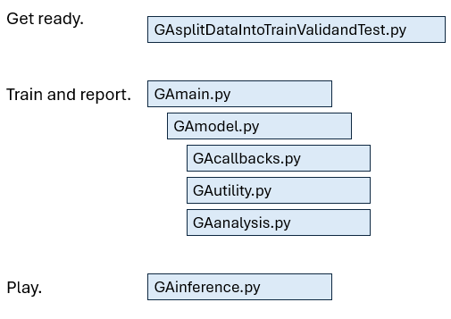

  
Python code that trains a model to label crystallization images.  

I found a research paper about an A.I. model that was trained to do binary classification on images of crystallization. 
I recreated the results in Python.  My metrics are a bit better and the training is faster.  My code is written in Python using Tensorflow, ResNet101 and ImageNet weights.  The metrics are presented in a ROC/AUC graph, a confusion matrix, class-wise test results, etc.  
 
[Code overview.](#code-overview) • 
[Model comparison](#model-comparison) • 
[Instructions](#Instructions) • 
[Contributions](#contributions) • 
[Known issues](#known-issues) • 
[Contact info](#contact-info)

## Overview. 
-The code for this project.  
Click "Code" on the repo page, then download zip or open with GitHub Desktop.  

-The reseach paper is here.  
[In Situ Imaging Combined with Deep Learning for Crystallization Process Monitoring: Application to Cephalexin Production.](https://www.sciencedirect.com/science/article/abs/pii/S1083616021010896)  

-The data is available on Kaggle.  
[OpenCrystalData Crystal Impurity Detection](https://www.kaggle.com/datasets/opencrystaldata/cephalexin-reactive-crystallization?resource=download)  

-The project's detailed documentation is here.  
[Go to the main doc file](docs/maindoc.md)  

## Code overview.  
  

## Model comparison.  
In the table below are the details offered by the published paper, then on the right are the choices that I elected to work with.   
|                         |Salami et al. paper     |my work                |
|-------------------------|------------------------|-----------------------|
|model type               |ResNet-18, ResNet-50    |ResNet-101             |
|optimization method      |SGDM	                  |Keras SGD (momentum .9)|
|learning rate 			  |1 × 10−4                |1 × 10−1	            |
|training data            |3200−3600 in each class |(same)                 |
|train/val./test %        |70/25/5%                |(same)                 |
|minibatch size 	        |32−64                   |64                     |
|validation frequency     |10−50                   |1                      |
|added dropout layers     |(did not comment)       |2                      |
|trainable ImageNet layers|(did not comment)       |made last 10% trainable|

## Instructions.  
   CODE  
   install a Python IDE (I used PyCharm, ver. 2023.2.4, Community Edition)  
   clone this repo (add repo link)  
   install dependencies (I used Python 3.8; TensorFlow 2.10.1; TensorFlow addons 0.21.0)

   DATA  
   clone the data  
   click here for the dataset  
   
   TRAINING  
   edit the directories in GAmain and GAmodel for your pc.  
   run GAmain to train and analyse.  
   navigate to the deliverables folder to see results.  
   click here for the paper abstract to compare results.   

   PLAY TIME  
   edit the directories in GAinference.  
   run GAinference.  

## Contributions.  
If you found an issue or would like to submit animprovement to this project, please submit an issue with the issue tab above.  If you would like to submit a PR with a fix, reference the issue you created, please.  

## Known issues.  
None.  

## Contact info.  
For more details about this project, feel free to reach out to me.  
Email Katherinemossdeveloper@gmail.com  
[LinkedIn](https://www.linkedin.com/pub/katherine-moss/3/b49/228)  

