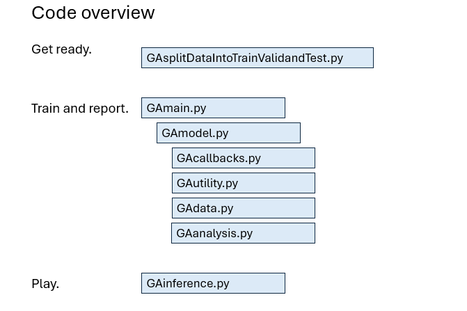

I found a research paper about an A.I. model that was trained to do binary classification on images of crystallization. 
I recreated the results in Python.  My metrics are a bit better and the training is faster.  My code is written in Python using Tensorflow, ResNet101 and ImageNet weights.  The metrics are presented in a ROC/AUC graph, a confusion matrix, class-wise test results, etc.  

-The code for this project.  
Click "Code" on the repo page, then download zip or open with GitHub Desktop.  

-The reseach paper is here.  
[In Situ Imaging Combined with Deep Learning for Crystallization Process Monitoring: Application to Cephalexin Production.](https://www.sciencedirect.com/science/article/abs/pii/S1083616021010896)  

-The data is available on Kaggle.  
[OpenCrystalData Crystal Impurity Detection](https://www.kaggle.com/datasets/opencrystaldata/cephalexin-reactive-crystallization?resource=download)  

-The project's detailed documentation is here.  
[Go to the main doc file](docs/maindoc.md)  

