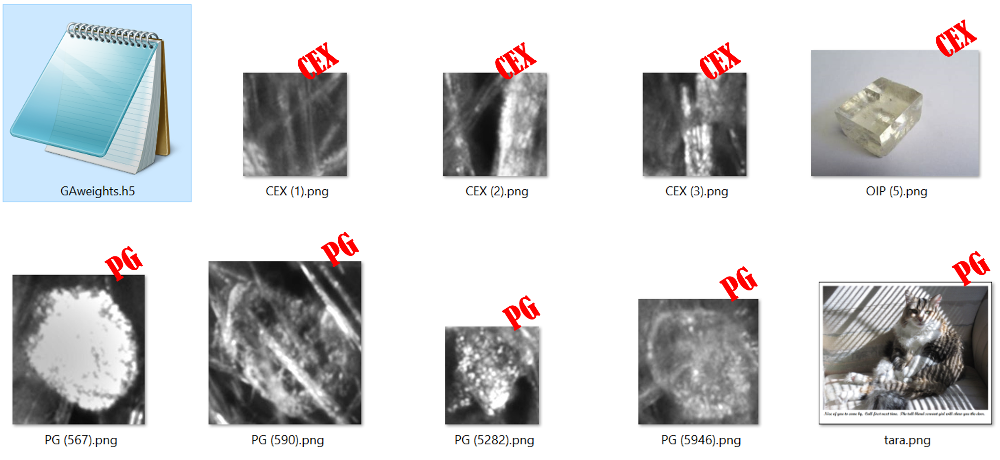

 

## Content.
<a href="#the-overview">
   The overview.
</a> 
<a href="#the-paper">
   The paper.
</a> 
<a href="#the-goals">
   The goals.
</a> 
<a href="#the-development-environment">
   The development environment.
</a> 
<a href="#the-model">
   The model architecture.
</a> 
<a href="#the-data">
   The data.
</a>   
<a href="#the-results">
   The results.
</a> 
<a href="#the-georgia-code-and-deliverables">
   The georgia code and deliverables.
</a> 
<a href="#how-to-recreate-the-results">
   How to recreate the results.
</a> 
<a href="#the-license">
   The license.
</a> 
<a href="#contact-info">
   Contact info.  
</a> 
<a href="#the-footnotes">
   The footnotes.
</a> 

## The overview
I am pleased to say that I have successfully trained an A.I. model to distinguish between two crystal types in images.  The trained model had all F1 scores above 99.7% in 5 epochs or less. 

I am a software developer doing an independent study into using machine learning to identify crystallization in images.  I found an interesting dataset and a really good research paper on the topic, so I wrote code to train on the data, using the paper for guidance.  I am posting the code and results here in the hope that others will also find it interesting.  

I found the crystal image dataset on Kaggle.  I decided to work with it because there were enough images to train with, and the images are all high quality.  Here is the hyperlink to the dataset.  

https://www.kaggle.com/datasets/opencrystaldata/cephalexin-reactive-crystallization?resource=download
The dataset I found was collected using Mettler-Toledo, LLC, (MT) instrumentation.  While this is not a research paper, where one would typically make an affiliation statement, I should mention that I worked at MT on their vision products for years.  However, I am no longer affiliated with the Company and am not necessarily endorsing their products here, nor have I used any intellectual property owned by MT.  

I chose crystallization in images because I think it is an important area of A.I.  Other corners of the A.I. world, like LLM’s, video creation, and robotics, are in the news more these days, but the detection and categorization of crystallization in images is important because it is used in the food processing, drug discovery, quality control in manufacturing, etc.  It would be good to have more developers and data scientists interested in this part of A.I.  

This study is about the crystallization dataset on Kaggle.  However, in this documentation, to make things easer, I will refer to the dataset as the “GA data,” and this project as the “Georgia Project,” since all of the authors were at the School of Chemical & Biomolecular Engineering, Georgia Institute of Technology in Atlanta, GA, which happens to be my husband’s alma mater.  
[back to top](#content)   

## The paper  
The dataset references a paper,  

In Situ Imaging Combined with Deep Learning for Crystallization Process Monitoring: Application to Cephalexin Production.  
Hossein Salami, Matthew A. McDonald, Andreas S. Bommarius, Ronald W. Rousseau, and Martha A. Grover
Organic Process Research & Development 2021 25 (7), 1670-1679
DOI: 10.1021/acs.oprd.1c00136  

This paper will be referred to here as “the paper.”  Below is a hyperlink to an abstract of the paper, along with a supplemental file.   The full paper is only available behind paywalls.  I purchased a copy in order to continue my study, so I ethically cannot share my copy with others here.  However, here is the abstract, which is public.  

https://www.sciencedirect.com/org/science/article/abs/pii/S1083616021010896  

What I can say, without going against the spirit of the pay wall agreement, is that the scientists who wrote the paper trained ResNet models with ImageNet weights on the GA data.  It was a binary classification of images of crystals, designating them as either CEX (a.k.a., “cephalexin antibiotic,” a good thing) or PG (a.k.a. “phenylglycine,” a bad thing).  They used both ResNet-18 and ResNet-50.  They used MATLAB 2020b Deep Learning Toolbox and deepNetworkDesigner app.  
[back to top](#content)   

## The goals
I wanted to create useful code, documentation, and weights that use the paper’s guidance and its binary dataset of crystallization images.  The code and/or weights that I produce could be useful because they are in a popular technology (Python/TensorFlow/Keras), along with details about the results.  
[back to top](#content)   

## The development environment.
The paper does not mention whether the MATLAB work done is publicly available.  Therefore, I tried to recreate their work with my code, which is written in Python with TensorFlow (Python 3.8; TensorFlow 2.10.1; TensorFlow addons 0.21.0).  I used PyCharm (ver. 2023.2.4, Community Edition) as the IDE.  See sections a., b., and c. of “The Georgia code and deliverables” for more.   

For hardware, I used a Quadro P1000 GPU, using CUDA version 12.2, with 4 GB of memory.  I did not see in the paper what hardware was used in the study.  
[back to top](#content)   

## The model.  
In the table below are the details offered by the published paper, then on the right are the choices that I elected to work with.   
|                         |Salami et al. paper     |my work                |
|-------------------------|------------------------|-----------------------|
|model type               |ResNet-18, ResNet-50    |ResNet-101             |
|optimization method      |SGDM	                   |Keras SGD (momentum .9)|
|learning rate 			      |1 × 10−4		             |1 × 10−1	             |
|training data            |3200−3600 in each class |(same)                 |
|train/val./test %        |70/25/5%                |(same)                 |
|minibatch size 		      |32−64                   |64                     |
|validation frequency     |10−50                   |1                      |
|added dropout layers     |(did not comment)       |2                      |
|trainable ImageNet layers|(did not comment)       |made last 10% trainable|

The trained model had all F1 scores above 99.7% in 5 epochs or less.  Here are the changes that have made the metrics better and the training runtimes shorter. 

1.  used ResNet-101.  See “GAmodel.py.”   
The paper used ResNet-18 and ResNet-50.  I thought it would be interesting if I used the more complex model architecture here.  

2.  changed the learning rate from 1E-4 to 1E-1.  See “GAmain.py.”  
I slowly made the learning rate larger until I got to 1E-1.  The model could learn faster, without losing its mind.  

3.  added two Dropout layers, with drop out rates at .4 and .3 respectively.  See “GAmodel.py.”  
I added these because I usually do add them when training models. 

4.  made 10% of the ImageNet layers trainable.  See “GAmodel.py.”    
I made these layers trainable on a lark, not knowing if they would make a difference.  They did.  

I also wrote code to split the data into training, validation, and test sets.  See section a. in “The Georgia code and deliverables.”  I added code that would stop the training based on the F1 scores.1  See “GAcallbacks.py.”  
[back to top](#content)  

## The data.  
There are 6,860 image files for each of the two classes of crystal images.  
|             |PG                |CEX              |
|-------------|------------------|-----------------|
|Train 	      |4,762 image files |4,802 image files|
|Validation 	|1,701 image files |1,715 image files|
|Test		      |  341 image files |  343 image files|
|Totals       |6,804 image files |6,860 image files|

The paper remarks that the two image sets have “very distinct visual features.”  Here are some of the CEX images.  Below that are some PG images.  While the CEX images are distinctive, let me suggest here that the PG data varies.  
  
  

The folder structure is as follows during training, validation, and testing.  PG images are put in the “1” folder, and CEX are put in the “0” folder.  The GAsplitDataIntoTrainValidandTest.py code will set up these folders, and the GAmain.py code file will refer to these locations during training.  You will, of course, need to modify these files to create the folder structure on your computer.   See the “How to recreate the results” section for more.  

…\GAtrainBinary  
    \0  
    \1  
…\GAvalidBinary  
    \0  
    \1  
…\GAtestBinary  
    \0  
    \1  
[back to top](#content)  

## The results.  
The final code had all F1 scores above 99.7% in 5 epochs or less.  The details of the training runs for this final version are in section D. below.  
To produce these numbers, I re-ran versions of the code so that I could understand exactly what delivered the best metrics and shortest runtimes for training.  I found that making 10% of the ImageNet layers trainable improved metrics.  I found that adding two Dropout layers improved metrics.  Finally, I found that both of them, together, produced a better model.  
This seems contradictory.  When layers are trainable, more weights are getting updated.  When dropouts are used, some weights are getting dropped.  These changes seem to be at odds with each other.  However, I can say that with this data, and this Resnet model, and these ImageNet weights, dropout layers and trainable layers together made the model better.  I want to try this idea on other data and architectures in the future.  
Below are the training details.  The words “last good” refers to my base version of the Python code I used, which is version 1 on GitHub.  Each line in the tables below represents a training and test run.  There are four categories, A. through D., with D. being the final version with the best resutls.  If you have any questions, or would like more details, write to me.
Here are the column names in the tables below and their meanings.

|variable name     |definition                                                                |
|------------------|--------------------------------------------------------------------------|
|run name	         | the unique name given to the run.                                        |
|run time	         | the time it took to train, then run the results code to get metrics.     | 
|train acc	       | the training accuracy of the last epoch, reported in the output window.  | 
|valid acc	       | the validation accuracy of the last epoch, reported in the output window.|   
|test acc	         | the test accuracy, reported in GAFinalTestResults.txt file.              |   
|acc delta	       | the validation accuracy minus the training accuracy.                     |   
|test missed	     | the no. of miss-classified images, reported in the confusion matrix.     |   
|epochs		         | the number of epochs completed during the training.                      |   
|learning rate	   | the learning rate used throughout the training.                          |   
|dropout layers	   | the status of the dropout layers, shown in the GAmodel.py.               |   
|trainable layers  | the status of the top 10% ImageNet layers, shown in the GAmodel.py.      |   

Here is a note on formatting of floats.  For some of the runs, for example GArun_27, the GAfinal_confusion_matrix.png showed 1 error, which is in the ‘test missed’ column.  Meanwhile, the ‘test acc’ column shows a note about the results of the GAFinalTestResults.txt.  In these runs, the final class-wise breakdown showed 100% in all categories.  This is due to formatting of floats.  I could have changed the call to sklearn.metrics.classification_report, which produces the final class-wise breakdown, so that 4 decimals, or so, were used, but I did not bother to do that.  Also, seeing 100% anywhere in metrics in the machine learning world is, of course, a mark of over-fitting.  I do not believe that we have that problem here.  

Generally, in C. and D. training runs below, the dropout layers made the model run consistently longer.  In the B. training runs, where 10% of the ImageNet weights were being trained, I do not see an improvement over the A. runs.  However, in D., with both dropouts and 10% training of ImageNet weights, I see the best combination.  

A.	The last good version, with no dropouts and no trainable ImageNet layers.  
   

B.	The last good version, with no dropouts, but with trainable ImageNet layers.  
  

C.  The last good version, with dropouts and with no trainable ImageNet layers.  
  

D.  The last good version with dropouts and trainable ImageNet layers:  the porridge that is just right.  
  
[back to top](#content)  

## The georgia code and deliverables.  
Sections a. through c. below are notes on the Python code files.  Sections d. through i. are the notes about the deliverables.  

The Georgia code overview.  
   

a.  The code to split up the data.  
GAsplitDataIntoTrainValidandTest.py	
This code splits the data into 70% training data, 25% validation data, and 5% test data, because that is the way that it is divided up in the paper.

b.  The training and analysis code. 
Generally, this next section of code files further preprocesses the data, trains the ResNet-101 model, then reports results.  The model will load the Keras built-in ImageNet weights.  It will train with the hyperparameters in the paper, with exceptions mentioned in “The model” section.  The code is organized into files, or modules, which call each other, in roughly the order here.

GAmain.py        
This module sets up the folder system and basic variables for the model.  It will then call   GAmodel.py. 

GAmodel.py       
This module creates a ResNet-101 model, loads ImageNet weights, trains, and then calls GAanalyze.py to reports results.

GAcallbacks.py  
This module creates the callbacks2 that the model will need during training. 
GAutility.py    
This module organizes largely unrelated pieces of code in one place.  Its principal use is to create various dataset objects.
GAanalysis.py    
Finally, this code is called after the training, at which time it creates the plots and other results from the training and testing.  

c.  The inference code. 
It is time to play.  After you trained the model, the file GAinference.py can then perform inference on any png file that you give it.  Below are some examples.  When you call the predict function of the model, you get back the percent chance that the image is of phenyglycine.  In other words, the predict call (roughly) answers the question “is this a picture of phenylglycine?”  So, if you put a picture of a cat in your inference folder, it should be tagged as cephalexin, but that was not true in our samples run below. 

As an example of an inference run, here is a collection of images, most of which are from the GA dataset, with a few wildcards thrown in.*  Note that the weights file is here, as the code expects.  Each weights files is created at the end of the training.  The computers date and time stamp are part of the name, so that previously created weights files are not overwritten.  Therefore, your weights files is have a different name than the one shown here.   

|image              |prediction                         |
|-------------------|-----------------------------------|
|File CAT_TARA.png  | prediction PG confidence 0.5501   |
|File CEX (2344).png| prediction PG confidence 1.0000   |
|File CEX (293).png	| prediction PG confidence 1.0000   |
|File CEX (3).png	  | prediction PG confidence 0.9486   |
|File OIP (5).png	  | prediction PG confidence 0.5020   |
|File PG (5282).png	| prediction CEX confidence 0.0000  |
|File PG (567).png	| prediction CEX confidence 0.0023  |
|File PG (590).png	| prediction CEX confidence 0.0000  |
|File PG (5946).png	| prediction CEX confidence 0.0071  |

The following notes are about the deliverables created at the end of the training run.  

d.  The resulting weights files in the HDF5 format, native to TensorFlow, and in the ONNX format, for developers working in other environments, like ML.NET.  

<pre style="font-family: 'Courier New', Courier, monospace;">
   GAweights_2025-03-22_16-43-54.h5  
   GAweights_2025-03-22_16-43-54.onnx  
</pre>

e.  In the ouput window in PyCharm, during training, there are class-wise text breakdowns of the test precision, recall, macro average, weighted average3, and F1-scores.1 

<pre style="font-family: 'Courier New', Courier, monospace;">
   Epoch 3 - Class-Wise Metrics:
   PG -  Precision: 0.9988, Recall: 0.9982, F1-Score: 0.9985
   CEX - Precision: 0.9982, Recall: 0.9988, F1-Score: 0.9985
   macro avg - Precision: 0.9985, Recall: 0.9985, F1-Score: 0.9985
   weighted avg - Precision: 0.9985, Recall: 0.9985, F1-Score: 0.9985
</pre>

f.   Next come the GAFinalTestResults.txt file.  After the training is completed, the model attempts to distinguish images in the two classes from each other.  The word “support” here tells us how many files the model used to determine the precision, recall, and F1 scores.   
            
|             |precision | recall | f1-score |  support|
|-------------|----------|--------|----------|---------|
|          PG |    0.99  |   1.00 |    1.00  |     341 |
|         CEX |    1.00  |   0.99 |    1.00  |     343 |
|             |          |        |          |         |  
|    accuracy |          |        |    1.00  |    684  |
|   macro avg |    1.00  |   1.00 |    1.00  |    684  |
|weighted avg |    1.00  |   1.00 |    1.00  |    684  |  
[back to top](#content)  

g.  GAmetrics_plot.png, the plot of training accuracy and validation accuracy.  
  

h.  GAfinal_confusion_matrix.png, the confusion matrix.  
  

i.  GAfinal_roc_auc.png, the ROC graph with AUC.  
  
[back to top](#content)  

## How to recreate the results.  
These instructions were written for my Windows PC.  The data zip file is over 1 GB, so you will need a drive with some free space on it to work with this data.  There are notes at the top of each code file about the minimum one needs to do to run the code.  

Step 1. download the data.   
Navigate to the Kaggle website using this hyperlink, create an account (which you can do for free), sign into the site, and press the “Download” button.  Downloading and extraction can take a while, so go get another cup of coffee.  

https://www.kaggle.com/datasets/opencrystaldata/cephalexin-reactive-crystallization?resource=download

Extract the data from the archive.zip file.  The data structure created during extraction for the cropped image files is like this…
<pre style="font-family: 'Courier New', Courier, monospace;">
   your_drive_letter_and_folder/archive/cropped/cropped/cex
   your_drive_letter_and_folder/archive/cropped/cropped/pg
</pre>

Step 2. spit up the data.  
Open the GAsplitDataIntoTrainValidandTest.py code file in the Python IDE of your choice.  Edit the folder structure strings for your computer by replacing the phrase “your_drive_letter_and_folder” with your folder location.  If the “destination folders” do not already exist, they will be created.  These folder names are just suggestions, of course.  Read the “to do” list in the top of the file for more information  (Note that I added spaces below, so that the strings would line up and be easier to read here.  In Python, the editor would complain about this spacing.)  

Define source folders.  
<pre style="font-family: 'Courier New', Courier, monospace;">
   source_pg = r"your_drive_letter_and_folder\archive\cropped\cropped\pg"
   source_cex= r"your_drive_letter_and_folder\archive\cropped\cropped\cex"
</pre>  

Define destination folders.  
<pre style="font-family: 'Courier New', Courier, monospace;">
 	 train_pg_dest = r"your_drive_letter_and_folder\GAtrainBinary\1"  
 	 train_cex_dest= r"your_drive_letter_and_folder\GAtrainBinary\0"  
 	 valid_pg_dest = r"your_drive_letter_and_folder\GAvalidBinary\1"  
 	 valid_cex_dest= r"your_drive_letter_and_folder\GAvalidBinary\0"  
 	 test_pg_dest  = r"your_drive_letter_and_folder\GAtestBinary\1"  
 	 test_cex_dest = r"your_drive_letter_and_folder\GAtestBinary\0"  
</pre>    

Step 3. prepare for training.  
Open the GAmain.py code file.  Change the folder strings to suit your folder layout.  
<pre style="font-family: 'Courier New', Courier, monospace;">
 	 deliverables_folder = r"your_drive_letter_and_folder\your_deliverables_folder"  
</pre>    
<pre style="font-family: 'Courier New', Courier, monospace;">
 	 train_directory = r"your_drive_letter_and_folder\GATrainBinary"   
 	 val_directory   = r"your_drive_letter_and_folder\GAValidBinary"  
 	 test_directory  = r"your_drive_letter_and_folder\GATestBinary"  
</pre>    
Note that the source_pg and source_cex are pointing to the location that the extracted zip file created.  Also note that the train_directory is pointing to the same location as the train_pg_dest and train_cex_dest are.  The same is true of val_directory and test_directory.  

Setting up debugging folders and data. 
Sometimes when debugging, it is nice to have a way to run a short “rehearsal” training.  If you want that, in the GAmain.py code, set the variable really_training = False.  Then edit the folders for debugging to point to an abbreviated version of the files.  To fill up the train, validation, and test image file folders for debugging, I copied about 10% of the files from the “real” training folders.  The epochs variable is set to 3, again so that the run is short.  Note that your metrics will probably look bad when you run your debugging sub-set of the data because the model will not have time to train on the data, nor enough data to train with.  Debugging in this way is for testing things like a new result file, not model performance.  

4. train.  
To train the model, start the GAmain.py file.  You can watch progress in the output window of PyCharm.  

5. view results.  
All files generated will be in your deliverables folder that you designated in the GAmain.py code file.  

6. play with it.  
Lastly, there is a code file, GAinference.py, that will perform inference on any png file that you give it.  To use this file, open it and change the file directory to a directory of images on your computer.  In the same folder, place the GAweights….h5 weights file from your deliverables folder after training.  Edit the folder string below to suit your file structure.  See the “to do” section at the top of the file for more details.  

<pre style="font-family: 'Courier New', Courier, monospace;">
   image_folder = r'your_drive_letter_and_inference_folder'  
   weights_file = r'your_drive_letter_and_inference_folder\your_weights_file.h5'
</pre>  
[back to top](#content)  

## The license.  
This project is licensed under the MIT License.  See the license.txt file for details.  
[back to top](#content)  

## Contact info.                                                                     
For more details about this project, feel free to reach out to me  
at katherinemossdeveloper@gmail.com or [LinkedIn](https://www.linkedin.com/pub/katherine-moss/3/b49/228).  
[back to top](#content)  

## The footnotes.  
TBD  
[back to top](#content)  
